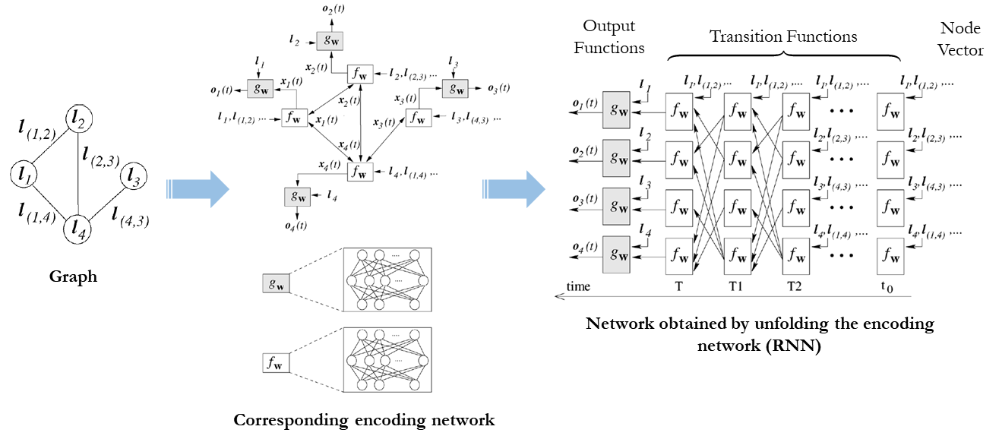

# Graph Neural Networks (GNN)

Graph Neural Network {cite}`scarselli_gori_tsoi_hagenbuchner_monfardini_2009` is a type of neural Network which directly operates on the graph structure. In GNN, graph nodes represent objects or concepts, and edges represent their relationships. Each concept is naturally defined by its features and the related concepts. Thus, we can attach a hidden **state** $x_n \in R^s$ to each node $n$ that is based on the information contained in the neighborhood of $n$. The following figure illustrated the embedding process of each node using local transition and local output functions.

where $l_n,l_{co[n]},x_{ne[n]}$ and $l_{ne[n]}$ are the label of $n$, the labels of its edges, the states, and the labels of the nodes in the neighborhood of $n$, respectively.
$x,o,l$ and $l_N$ are the vectors constructed by stacking all the states, all the outputs, all the labels, and all the node labels, respectively as illustrated below.

The following figure summarizes the GNN-based embedding process {cite}`DBLP:journals/corr/abs-1906-01227`.

GNN is used in several smart mobility applications. For example, the accuracy of real time ETAs was improved by up to 50% in places like Berlin, Jakarta, São Paulo, Sydney, Tokyo, and Washington D.C. by using advanced machine learning techniques including Graph Neural Networks, such as [DeepMind](https://deepmind.com/blog/article/traffic-prediction-with-advanced-graph-neural-networks).

## Graph Convolutional Neural Network (GCNs)

In a graph convolutional neural network, embedding can take the following form:  
$h^k_v=f(W_k \sum\limits_{u \in N(j)} \frac{1}{|N(v)|} h^{k-1}_u + B_k h^{k-1}_v), \forall k \in \{1,...,K\}$   
where  
$h_v^k$ is node $v$ embedding after $k$ layers of neighbourhood aggregation  
$\sum\limits_{u \in N(j)} \frac{1}{|N(v)|} h^{k-1}_u$ are neighbors’ representations (average of neighbor’s previous layer embeddings)  
$B_k h^{k-1}_v$ represent own representation of node $v$ in previous layer $k-1$  
$f$ is a non-linearity function such as ReLU.

## Resources:
- [Graph Convolutional Network Technique for the Travelling Salesman Problem](https://github.com/chaitjo/graph-convnet-tsp)
- A library for graph neural networks in jax ([Jraph](https://github.com/deepmind/jraph))
- Deep Graph Library ([DGL](https://github.com/dmlc/dgl))
- Graph Nets Library ([Graph Nets](https://github.com/deepmind/graph_nets))
- PyTorch Geometric Library ([PyTorch Geometric](https://pytorch-geometric.readthedocs.io/en/latest/))
- Stanford Network Analysis Platform ([SNAP](https://github.com/snap-stanford/snap-python))